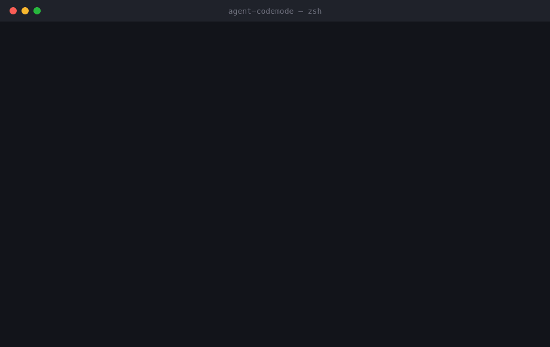

# agent-codemode

[](https://www.npmjs.com/package/agent-codemode)
[](./LICENSE)
[](https://nodejs.org)

**Code mode for the coding agent you already run.**

Cloudflare's code mode gives an agent an entire API in ~1,000 tokens — but you
still have to build the agent, and bring an API key for everything it touches.
Your coding agent already finished that part. Claude Code holds a live OAuth
token for every MCP server you have ever logged into. This reads them.

```bash
npx agent-codemode types --all      # typed TypeScript for every server you're logged into
```

No API keys. No OAuth flow. No sandbox to deploy. No model in the loop.



## Quickstart

```bash
npm install -g agent-codemode    # also installs a shorter `codemode` alias
```

```bash
agent-codemode servers                 # who has a live token
agent-codemode tools linear            # what can it do
agent-codemode call linear list_issues --arg assignee=me --arg state="In Progress" --text
```

Requires Node 18+.

## The typed API

`agent-codemode types` reads a server's live `tools/list` and emits a `.ts` module —
every tool as a method, every input schema as an interface, every description as
JSDoc:

```ts
// Generated by agent-codemode from linear's tools/list. Do not edit by hand.

export interface LinearListIssuesArgs {
  /** Max results (default 50, max 250) */
  limit?: number;
  /** State type, name, or ID */
  state?: string;
  /** User ID, name, email, or "me" */
  assignee?: string | null;
  /** 0=None, 1=Urgent, 2=High, 3=Medium, 4=Low */
  priority?: number;
}

export interface LinearClient {
  listIssues(args?: LinearListIssuesArgs): Promise<ToolResult>;
  // …52 more
}
```

Each generated module also registers itself with `mcp`, so importing it is all
it takes — there is no cast and no type argument at the call site:

```ts
import "./mcp-types";              // side-effect import; registers every server
import { mcp } from "agent-codemode";

const issues = await mcp.linear.listIssues({ assignee: "me", state: "In Progress" });
```

```ts
mcp.linear.listIssues({ bogus: 1 });      // ✗ 'bogus' does not exist in LinearListIssuesArgs
mcp.linear.listIssues({ limit: "fifty" }); // ✗ string is not assignable to number
mcp.linear.noSuchTool({});                 // ✗ does not exist on LinearClient
```

Those types cost your agent nothing at runtime — they live in your editor, not
in a context window. And they stay optional: without the import,
`mcp.linear.listIssues({ … })` still runs, just with `Record<string, unknown>`
arguments. A server you never generated types for keeps working.

## One script, three servers, zero credentials

This is the part no other code mode can do. Every server below authenticated
itself once, through your coding agent. There is no `.env` in this example
because there is nothing to put in it:

```ts
import { mcp } from "agent-codemode";

const [issues, events, channel] = await Promise.all([
  mcp.linear.listIssues({ assignee: "me", limit: 50 }),
  mcp.axiom.queryDataset({ apl: "['prod'] | where _time > ago(24h) | summarize count()" }),
  mcp.slack.slackSearchChannels({ query: "general" }),
]);
```

```
linear   49 open · 12 In Progress · 36 In review · 1 Planned
axiom    24,385,957 events in sample-http-logs / 24h
slack    #general → C06CS3MUQN9

*Standup* — 49 open, 18 high priority
24,385,957 events in the last 24h.
Watch: HYR2-948, HYR2-947, HYR2-881, HYR2-625, HYR2-923 (+13 more)
```

The runnable version is [`examples/standup.ts`](./examples/standup.ts) — it
reads three servers, prints the digest, and only posts to Slack behind `--post`:

```bash
npx tsx examples/standup.ts
```

## Teaching your agent to use it

This repo ships a skill at
[`.claude/skills/agent-codemode/`](./.claude/skills/agent-codemode/SKILL.md).
Copy it into your own project — or into `~/.claude/skills/` to have it
everywhere — and Claude Code stops asking permission for twenty separate tool
calls and starts writing one script instead. That is the whole point, and it
works better when the agent knows the option exists.

```bash
mkdir -p ~/.claude/skills && cp -r .claude/skills/agent-codemode ~/.claude/skills/
```

## How this differs from the other code modes

| | Cloudflare Code Mode | TanStack AI | Code Mode SDK | **agent-codemode** |
| --- | --- | --- | --- | --- |
| Where the code runs | Worker sandbox | your app | your app | **your shell** |
| Auth for each tool | your API keys | your API keys | your API keys | **already done** |
| Needs a model | yes | yes | yes | **no** |
| Needs a deploy | yes | no | no | **no** |
| Several servers in one script | — | — | — | **yes** |
| Best for | agents you build | agents you build | agents you build | **your coding agent, scripting MCP in shell / JS / TS** |

They give code mode to an agent you are building. This gives it to the agent
already on your laptop.

The first user is the coding agent itself. Ask it to reconcile two trackers
today and it does twenty tool calls, paying for every intermediate result twice
— once into the model, once back out — and burning context on data it only
needed in order to hand to the next call. Give it this and it writes one script:
a loop, a filter, a join, and one answer read back at the end. That is code mode
in the plain sense. The model writes code, the code calls the tools.

The script it leaves behind is the second win, and the one that compounds. It is
a file. It runs again tomorrow from cron, or as a CI gate, with no model and no
tokens at all — which is also the answer to the reasonable objection that code
mode on top of MCP on top of code mode is a useless extra layer. This is not a
layer. It is the model *leaving*. A job that moves three tickets does not need
reasoning; it needs the token, and the token is already there.

## Why

An MCP server is a JSON-RPC endpoint. `claude mcp` can add, list and log in to
servers — it cannot *call* them. So the OAuth dance is already done and the
result sits unused, reachable only by a model deciding to reach for it, one tool
call at a time.

A script can talk to those servers directly. That is what you want any time
paying a model to relay a request is slow and expensive: while the agent works,
because a written script beats twenty round trips, and after it stops, because
the script keeps running from cron or CI on its own.

## What works

Verified end to end against a live install:

| Kind | Auth source | Example | Status |
| --- | --- | --- | --- |
| Remote HTTP MCP (OAuth) | Keychain | `linear`, `axiom`, `fastmail` | ✅ works |
| Self-hosted remote MCP | Keychain | `hyre-prod`, `hyre-staging` | ✅ works |
| Plugin MCP | Keychain | `plugin:slack:slack` | ✅ works |
| API-key HTTP/SSE MCP | config `headers` | `{ "type": "http", "headers": { … } }` | ✅ works |
| stdio MCP (local subprocess) | config `env` | `{ "command": "npx", … }` | ✅ works |
| claude.ai connector | claude.ai backend | `claude.ai Gmail`, `Google Calendar` | ❌ not yet — see below |

macOS is fully supported. On Linux/Windows the config-based servers (stdio,
API-key) work as-is, and Claude's OAuth tokens are read from
`~/.claude/.credentials.json`; the macOS Keychain path is skipped. Help
verifying Linux/Windows is welcome — see [CONTRIBUTING.md](./CONTRIBUTING.md).

**It reads other coding clients too.** The config files scanned aren't only
Claude's — Cursor, Windsurf, VS Code, and Gemini CLI keep MCP servers in the
same schema, and this reads them all (`agent-codemode servers` shows the `client` each
came from). So it inherits every client's **stdio and API-key** servers. OAuth
inheritance is Claude-only for now — other clients' OAuth servers show as
`unsupported` and are easy to add. Adding a client's config is one entry in
`src/clients.ts`.

**claude.ai connectors** are configured under a `claude.ai config` scope and have
no entry in the `mcpOAuth` store; they authenticate through the account-level
`claudeAiOauth` token, and the connector endpoint rejects any client whose name
contains "claude". Supporting them would mean impersonating Claude Code itself —
out of scope on purpose.

## How it works

Claude Code stores what a server needs in two places, and this package reads
both:

- **The macOS Keychain**, service `Claude Code-credentials`. Its `mcpOAuth` map
  is keyed `<serverName>|<urlHash>` and each entry carries `serverUrl`,
  `accessToken`, `refreshToken`, `clientId`, `issuer` and `expiresAt`. This is
  the OAuth HTTP servers.
- **The config files**, `~/.claude.json` (top-level `mcpServers` and
  per-project) and `.mcp.json`. A stdio server keeps its `command`, `args` and
  `env` here; an API-key server keeps its `url` and static `headers` here.
  `${VAR}` references in those fields are expanded from the environment, as
  Claude Code does.

For an HTTP server it speaks Streamable HTTP MCP — `initialize`, carry the
returned `Mcp-Session-Id`, `notifications/initialized`, then `tools/list` or
`tools/call`, accepting a JSON or an SSE response. For a stdio server it spawns
the subprocess and speaks the same JSON-RPC newline-framed over stdin/stdout.
One `McpSession` interface covers both.

## Three rules, learned the hard way

1. **Never cache the token.** Claude Code refreshes on its own schedule. This
   package re-reads the Keychain on every call, and so should you.
2. **Never try to refresh it yourself.** The `refreshToken` and `clientId` are
   right there, but Claude Code re-runs dynamic client registration on launch and
   orphans the previous pair
   ([claude-code#59460](https://github.com/anthropics/claude-code/issues/59460)),
   so your refresh may be rejected by a client the issuer has forgotten. If a
   token has expired, the fix is to start Claude Code, or
   `claude mcp login <server>`.
3. **An expired token is a loud error, never an empty result.** A gate that
   silently returns nothing because auth broke is indistinguishable from a gate
   that found no work — which is the failure that costs you a night.

## Security

Tokens are read fresh and never printed; this package only ever *reads*
credentials, and never writes, refreshes or transmits them anywhere except to
the server they belong to.

There is one thing about your machine worth knowing before you use this, and it
is true whether or not you install it. See **[SECURITY.md](./SECURITY.md)**.

## CLI

```
agent-codemode servers                       list every server (config files + Keychain)
agent-codemode tools <server>                list a server's tools
agent-codemode call <server> <tool> [args]   call a tool
agent-codemode types <server> [--out file]   generate a .ts types module for a server
agent-codemode types --all [--out dir]       generate a module per authed server + index barrel
agent-codemode types --url <url> [--name n]  generate for a raw endpoint (unauthenticated tools/list)

  --json '{"a":1}'      whole argument object as JSON
  --arg key=value       one string argument
  --arg key:=1          one JSON-valued argument (number, bool, array, object)
  --text                print only the text content of the result
```

Server names can be shortened when unambiguous: `agent-codemode call slack …` reaches
`plugin:slack:slack`.

Exit codes: `0` success, `1` error (credential, transport, usage), `2` the tool
itself reported `isError`.

## API

```ts
import {
  mcp, McpClient, callTool, listTools, resultText,
  listCredentials, getCredential, isExpired,
} from "agent-codemode";

// the proxy — no codegen needed
const issues = await mcp.linear.listIssues({ assignee: "me" });

// one-shot
const tools = await listTools("linear");

// or hold a session open across several calls
const client = await McpClient.fromClaudeCode("linear");
await client.connect();
const a = await client.callTool("list_issues", { team: "Hyre Ops" });
const b = await client.callTool("list_teams", {});
```

Set `MCP_PROTOCOL_VERSION` to advertise a different protocol revision.

## Licence

MIT © Jan Wilmake
